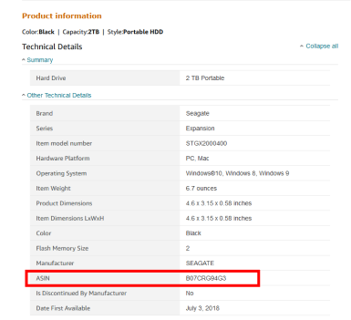
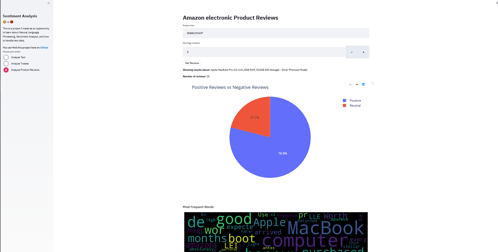

### Sentiment Analysis Web app using Streamlit + Sickit-learn

#### Summary

Web app to detect Sentiment (Positive vs Negative) in:

1. **Tweets**: Input a keyword, the app will fetch tweets ( 200 max due the API limitation), and outputs graphs.

2. **Amazon electronic products reviews**: input product asin_number and number of review pages you want the app to scrap, and outputs graphs.

    

### Screenshots



#### project folders

1. **data/** : datasets used to train the models.
2. **notebooks/**: code for data preparation and modeling.
3. **models/** :  trained model, used in Streamlit web app.

#### Datasets

- [tweets.csv](data/twitter_data.csv)
- [Amazon electronic products reviews](http://snap.stanford.edu/data/amazon/productGraph/categoryFiles/reviews_Electronics_5.json.gz)


#### Requirements

```
matplotlib==3.1.3
plotly==4.6.0
pandas==1.1.2
fake_useragent==0.1.11
nltk==3.4
selenium==3.8.0
streamlit==0.64.0
requests==2.25.0
wordcloud==1.8.0
tweepy==3.9.0
numpy==1.16.2
beautifulsoup4==4.9.3
matplotlib==3.3.4
scikit-learn==0.21.2
```

#### Installation

First it's recommended to create a [virtual environement](https://docs.python-guide.org/dev/virtualenvs/) to avoid dependecies conflict between projects.

clone the project and  install requirements using:

```
git clone https://github.com/Otman404/SentimentAnalysis.git
cd SentimentAnalysis
pip install -r requirements.txt
```

Once the requirements are installed, add your [Twitter API](https://developer.twitter.com/en/docs/authentication/oauth-1-0a/obtaining-user-access-tokens) credentials in [twitter_creds.py](twitter_creds.py) file and launch the Streamlit web app using:

```
streamlit run app.py
```

The app should be running in http://localhost:8501.

#### Warning

You might ge this error

```
AttributeError: 'SVC' object has no attribute '_probA'
```

This happens when scikit-learn version that was used to train this model is different from the version you have on your pc.
To solve this issue, just rerun the notebooks to get a model compatible with your installed version of scikit-learn.
